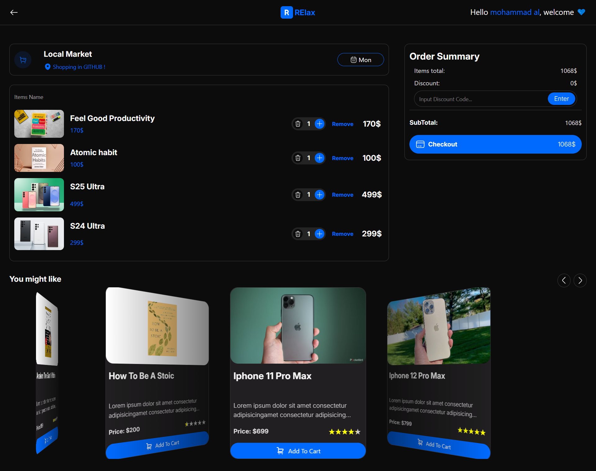
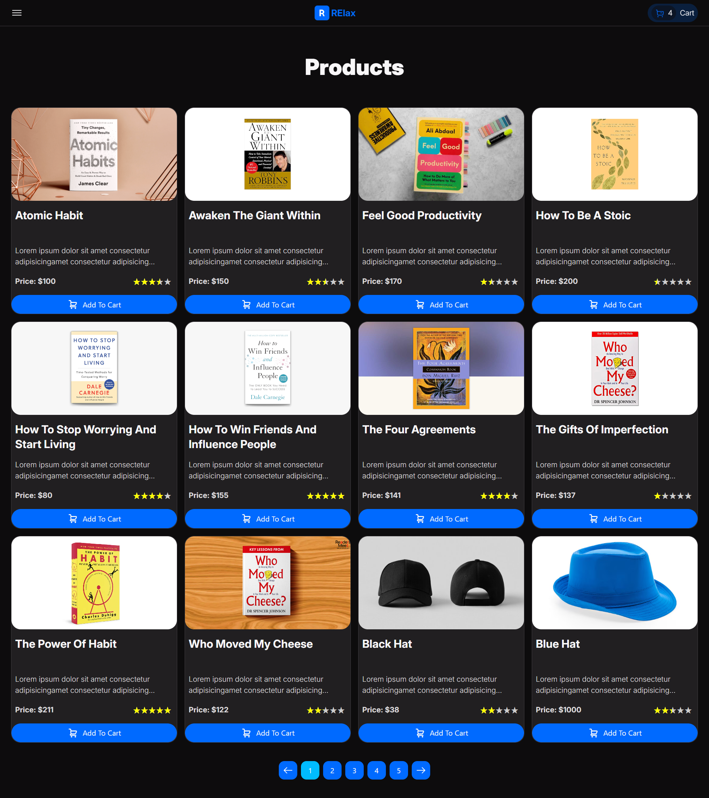
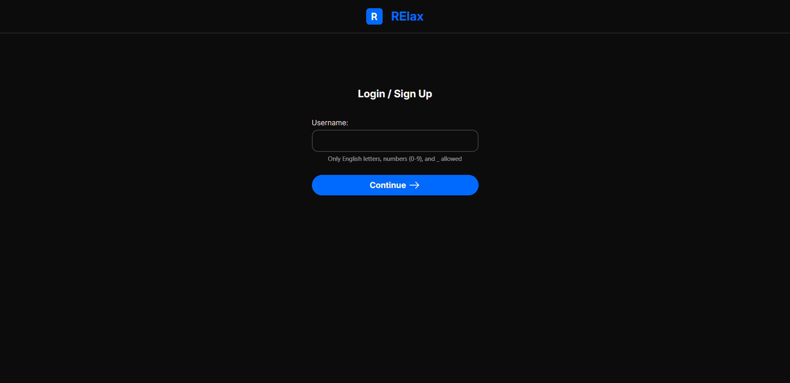

# Shopping cart project

### Cart page

### Products page

### Login page

A very simple shopping cart website that allows you to log in and add products to your cart.

The following items were used in this project:

- html
- css
- tailwindcss
- fontawesome
- Js Cookie
- Notyf js
- Sweet alert js
- Swiper js

## You can see it online here: [Shopping cart page](https://restesna.github.io/shopping-cart/)

Features:
1. add product to your basket
2. login and save your data
3. Suggest products similar to the ones you have in your cart
4. light and dark theme
5. Explore the rest of the features by yourself :)

### To use this project locally, be sure to install the dependencies.

Contact me: Telegram:  @REllaxam